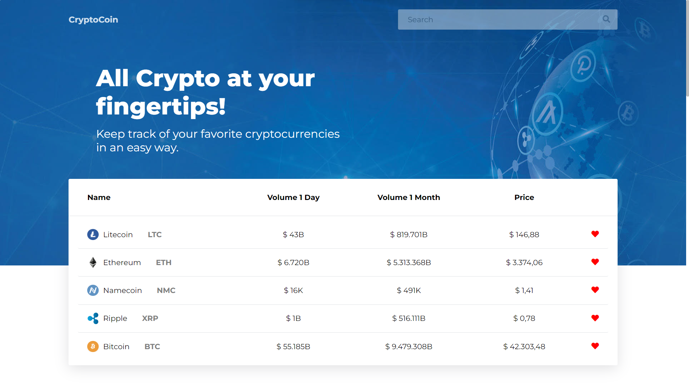

# Cryptocoin Project

This project is a crypto site, so with this site you can keep track of your favorite cryptocurrencies.

## Getting Started

To Starting using this Application, go to https://cryptocoinproject.netlify.app on your favourite browser, or if you want to try it locally download the project and rename the ".env.sample" file in ".env" and edit this with your api key (get it from "coinapi.io").

## Tools Used

Node npm

React

Netlify

Rest Api

## Usage

The usage is very simple, you can see crypto prices, you can select your favorites, and by clicking on it you can see more information about the crypto.

## Contact
Email: rey.hossa.rh@gmail.com

Project link: https://github.com/rey-hossa/CryptoCoin.git
